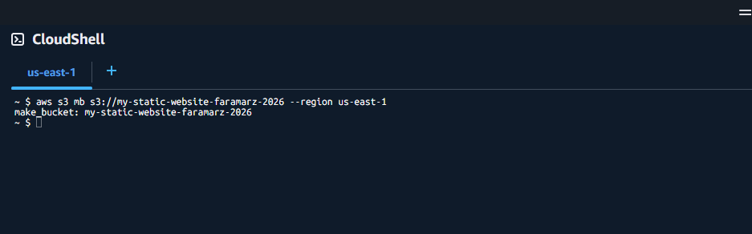
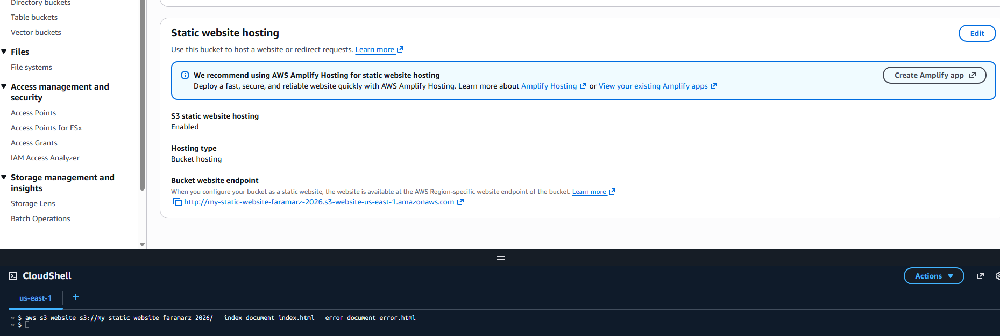
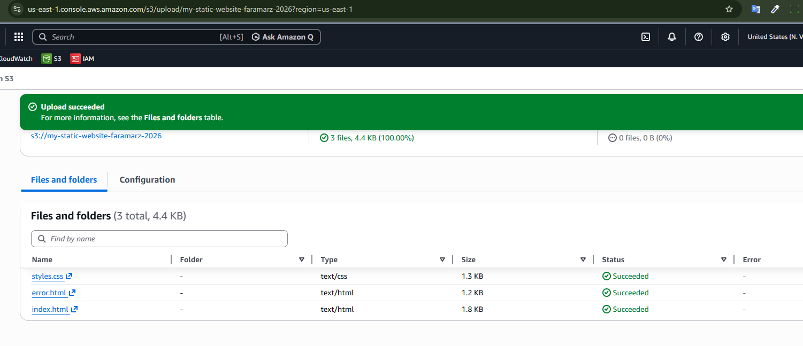
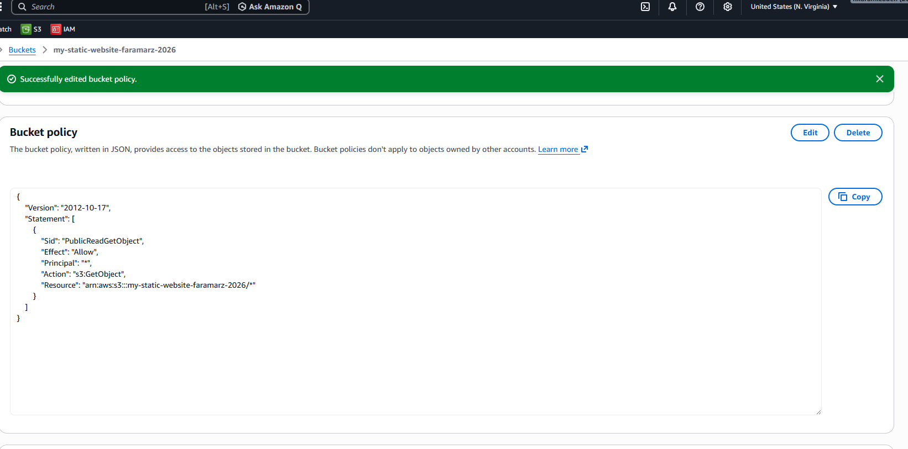
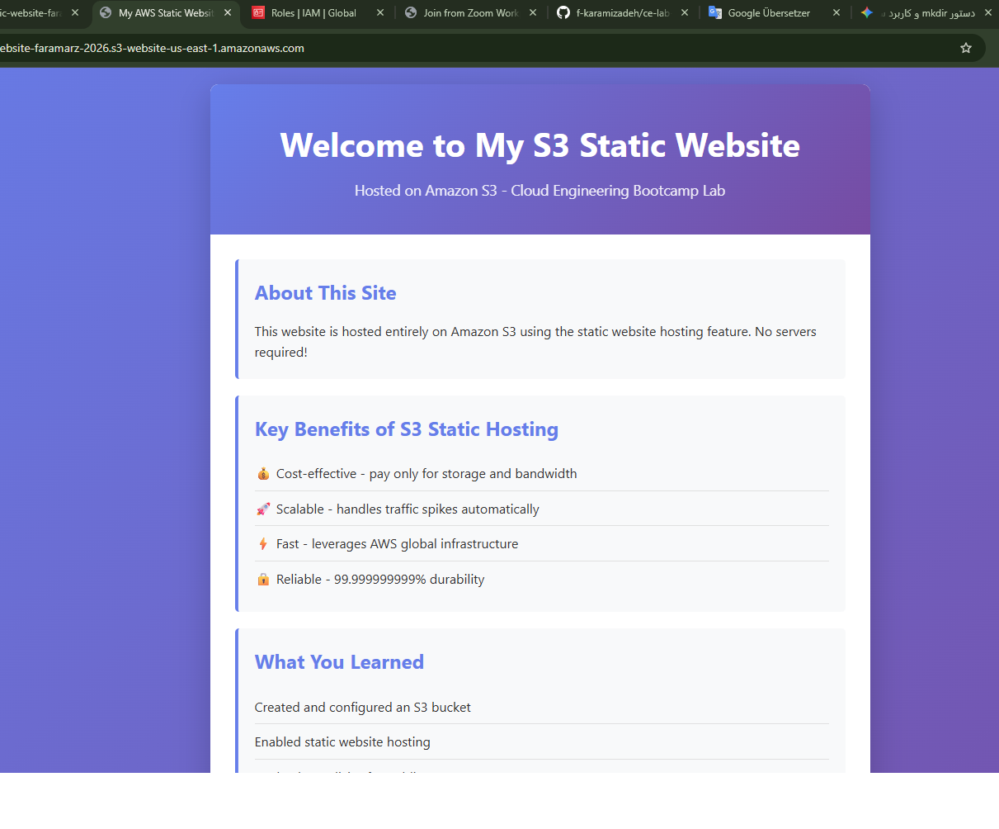

# Lab Solution: Host a Static Website on Amazon S3

**Student Name:** Faramarz Karamizadeh  
**Date:** 09.07.2026  
**Lab Completion Time:** ___________ minutes

---

## Part 1: Bucket Configuration

### Bucket Information

**Bucket Name:** my-static-website-faramarz-2026

**Region:** us-east-1

**Bucket Website Endpoint URL:**
```
___________________________________________________________
```

**Screenshot 1: Bucket Creation Confirmation**


---

## Part 2: Static Website Hosting Configuration

### Configuration Details

**Index Document:** index.html
**Error Document:** Error.html

**Screenshot 2: Static Website Hosting Settings**

**Bucket website endpoint:**
https://my-static-website-faramarz-2026.s3-website-us-east-1.amazonaws.com/
---

## Part 3: Website Files

### Files Created

List the files you created:
1. index.html
2. error.html
3. styles.css

**Did you customize the HTML/CSS?** (No): ______

**If yes, describe your customizations:**
```
_____________________________________________________________
_____________________________________________________________
_____________________________________________________________
```

**Screenshot 3: Files Uploaded to S3**


---

## Part 4: Bucket Policy

### Bucket Policy Applied

**Paste your complete bucket policy here:**
```json
{
    "Version": "2012-10-17",
    "Statement": [
        {
            "Sid": "PublicReadGetObject",
            "Effect": "Allow",
            "Principal": "*",
            "Action": "s3:GetObject",
            "Resource": "arn:aws:s3:::my-static-website-faramarz-2026/*"
        }
    ]
}
```

**Screenshot 4: Bucket Policy Configuration**


---

## Part 5: Testing and Verification

### Website Testing

**Website URL (from endpoint):**
```
http://my-static-website-faramarz-2026.s3-website-us-east-1.amazonaws.com/
```

**Did the website load successfully?** (Yes/No):Yes

**Did the CSS styling apply correctly?** (Yes/No): Yes

**Screenshot 5: Working Website**


### Error Page Testing

**Test URL used:**
```
http://my-static-website-faramarz-2026.s3-website-us-east-1.amazonaws.com/nonexistent.html
```

**Did custom error page display?** (Yes/No): Yes

**Screenshot 6: Custom 404 Error Page**


---

## Part 6: CLI Commands Used

**Document all AWS CLI commands you executed:**

```bash
# Bucket creation
aws s3 website s3://my-static-website-[your-initials]-2026/ \
  --index-document index.html \
  --error-document error.html

# Enable website hosting


# Upload files


# Apply bucket policy


# Verify configuration


```

---

## Bonus Challenges Completed

- [ ] Challenge 1: Added about.html page
- [ ] Challenge 2: Used subdirectories for organization
- [ ] Challenge 3: Used `aws s3 sync` command

**Bonus Challenge Notes:**
```
_____________________________________________________________
_____________________________________________________________
_____________________________________________________________
```

---

## Reflection Questions

### 1. What are the advantages of S3 static hosting compared to traditional web servers?

**Your answer:**
```
When comparing Amazon S3 static website hosting to traditional web servers (like an EC2 instance, Apache, or Nginx running on a Virtual Private Server), the advantages boil down to cost, maintenance, and scalability.
-Zero Server Maintenance
-Infinite & Automatic Scaling
-Lower Costs
-High Availability and Durability
```

### 2. Why is a bucket policy necessary for public website access?

**Your answer:**
```
By default, Amazon S3 is designed to be secure by default. When you create a new S3 bucket, it is completely private—meaning only you (the account owner) have permission to read or write files to it.

Even when you flip the switch to enable Static Website Hosting, S3 does not automatically make your files public. This is where a bucket policy comes in.
```

### 3. What are the limitations of S3 static website hosting?

**Your answer:**
```
While S3 static website hosting is incredibly powerful, cost-effective, and scales infinitely, it has strict technical boundaries. Because S3 is an object storage service and not a true web server, you cannot treat it like traditional hosting.
-No Server-Side Code Execution
-No Native HTTPS / SSL Support
-
```

### 4. When would you NOT use S3 for website hosting?

**Your answer:**
```
-When my Site Requires Server-Side Rendering (SSR).
-When Using Next.js or Nuxt.js with Dynamic Features.
-Intranets with Rapidly Changing internal Content
```
### 5. How does S3 static hosting fit into cost optimization strategies?

**Your answer:**
```
S3 static hosting eliminates fixed hourly server costs by charging me only for the exact storage and traffic my site uses. It handles massive traffic spikes automatically without needing expensive infrastructure.
```

---

## Troubleshooting Log

**Did you encounter any issues?** (Yes/No): ______

**If yes, document the issues and how you resolved them:**

| Issue | Error Message | Solution | Time to Resolve |
|-------|--------------|----------|-----------------|
|       |              |          |                 |
|       |              |          |                 |
|       |              |          |                 |

---

## Cleanup Confirmation

- [x ] Emptied S3 bucket
- [ x] Deleted S3 bucket
- [x ] Verified no resources remain

**Cleanup CLI commands used:**
```bash
# Empty bucket


# Delete bucket


```

---

## Self-Assessment

**Rate your understanding of each concept (1-5, where 5 is expert):**

| Concept | Rating | Notes |
|---------|--------|-------|
| S3 bucket creation | ___/5 |5 |
| Static website hosting configuration | ___/5 |5 |
| Bucket policies and public access | ___/5 |5 |
| Uploading and managing S3 objects | ___/5 | 5|
| S3 website endpoints | ___/5 | 5|
| HTML/CSS basics | ___/5 | 5|

---

## Instructor Verification

**Instructor Name:** ___________________________

**Date Reviewed:** ___________________________

**Website URL Verified:** ☐ Yes ☐ No

**Comments:**
```
_____________________________________________________________
_____________________________________________________________
_____________________________________________________________
```

**Grade/Status:** ___________________________

---

## Additional Resources Referenced

List any documentation, tutorials, or resources you used:

1. ___________________________________________________________
2. ___________________________________________________________
3. ___________________________________________________________

---

**Lab Status:** ❎ Complete ☐ Needs Revision

**Total Time Spent:** 70 minutes

**Submission Date:** 09.07.2026
